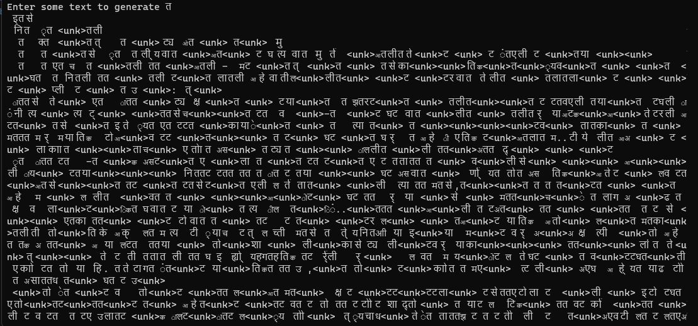

# Notes

I used mistral' model source code with my tweaks and some changes.
Please check the "[Mistral original repository](https://github.com/mistralai/mistral-src)" for the original code.     


This is not original mistral-7B or other model from huggingface, I lower the parameter counts in this to experiment and to learn the proceess of training llm model with just pytorch code without using any wrapper HF transformer, etc.   

Here I experimented with training my own tokenizer for Marathi language with small dataset to train tokenizer it has some limitation with small vocabulary.     
The problem with latest llm that they are largely trained on english text so for non-english text they tokenize it in more tokens than english text, it empacts on context length and inference.        

I trained my model with this parameters which mistral model architecture takes-     
```                    
                arg = ModelArgs(dim=1024,
                n_layers=12,
                head_dim=6,
                hidden_dim=4096,
                n_heads=8,
                n_kv_heads=4,
                norm_eps=1e-6,
                max_batch_size=8,
                vocab_size=200,
                sliding_window=4,
                )           
```
Trained for 5000 epochs still it not learned any language structure, cause of my tokenizer and small dataset,I think with more training it can get better.

## Output-




